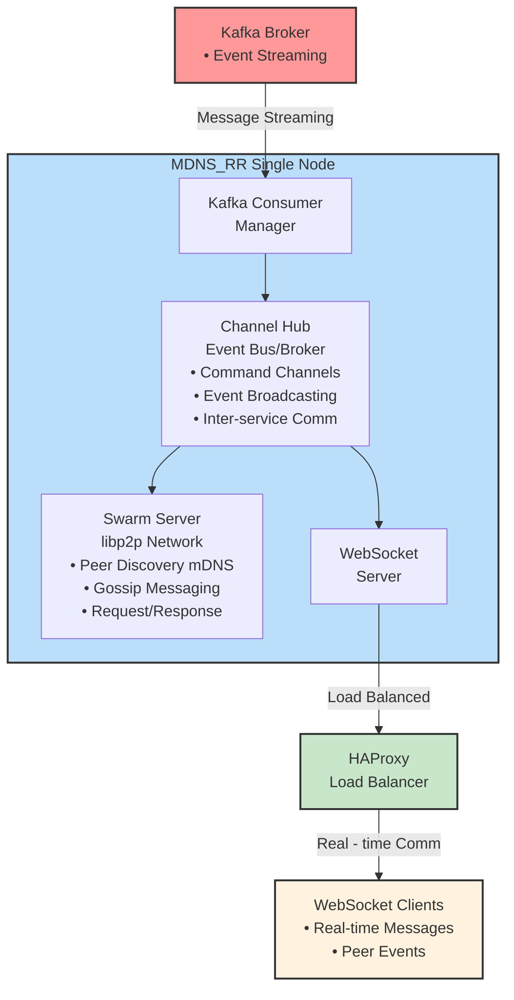
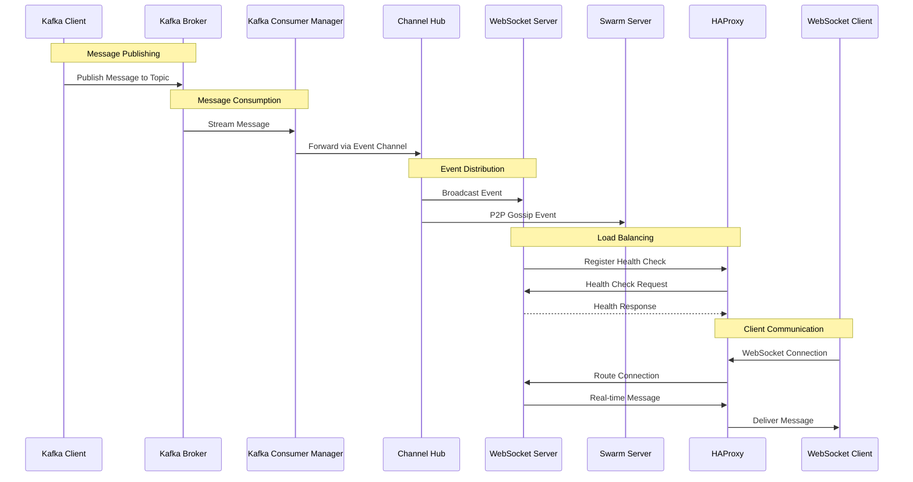
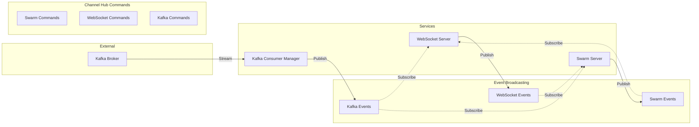

# MDNS_RR Architecture Documentation

## Overview

MDNS_RR is a distributed peer-to-peer communication system built in Rust that integrates multiple communication
protocols including libp2p networking, WebSocket connections, and Apache Kafka
messaging. The system provides real-time message broadcasting, peer discovery via mDNS, and HTTP REST APIs for
management.

## System Architecture

### High-Level Architecture



**Architecture Flow:**

1. **Kafka Broker** serves as the external data source, providing message streaming and topic-based event distribution
2. **MDNS_RR Single Node** contains all application components wrapped in a single deployment unit
3. **HAProxy Load Balancer** provides load balancing and high availability for WebSocket connections
4. **WebSocket Clients** connect through HAProxy to access real-time messaging and peer events

### Detailed Component Flow



### Service Interaction Matrix



```
Kafka:
-> Consumer 
    kafka_message: MarketData = {
    "client_id": "0",
    "round": 0,
    "c": 0,
    "content": "
    aaaaaaaaaaaaaaaaaaaaaaaaaaaaaaaaaaaaaaaaaaaaaaaaaaaaaaaaaaaaaaaaaaaaaaaaaaaaaaaaaaaaaaaaaaaaaaaaaaaaaaaaaaaaaaaaaaaaaaaaaaaaaaaaaaaaaaaaaaaaaaaaaaaaaaaaaaaaaaaaaaaaaaaaaaaaaaaaaaaaaaaaaaaaaaaaaaaaaaaaaaaaaaaaaaaaaaaaaaaaaaaaaaaaaaaaaaaaaaaaaaaaaaaaaaaaaaaaaaaaaaaaaaaaaaaaaaaaaaaaaaaaaaaaaaaaaaaaaaaaaaaaaaaaaaaaaaaaaaaaaaaaaaaaaaaaaaaaaaaaaaaaaaaaaaaaaaaaaaaaaaaaaaaaaaaaaaaaaaaaaaaaaaaaaaaaaaaaaaaaaaaaaaaaaaaaaaaaaaaaaaaaaaaaaaaaaaaaaaaaaaaaaaaaaaaaaaaaaaaaaaaaaaaaaaaaaaaaaaaaaaaaaaaaaaaaaaaaaaaaaaaaaaaaaaaaaaaaaaaaaaaaaaaaaaaaaaaaaaaaaaaaaaaaaaaaaaaaaaaaaaaaaaaaaaaaaaaaaaaaaaaaaaaaaaaaaaaaaaaaaaaaaaaaaaaaaaaaaaaaaaaaaaaaaaaaaaaaaaaaaaaaaaaaaaaaaaaaaaaaaaaaaaaaaaaaaaaaaaaaaaaaaaaaaaaaaaaaaaaaaaaaaaaaaaaaaaaaaaaaaaaaaaaaaaaaaaaaaaaaaaaaaaaaaaaaaaaaaaaaaaaaaaaaaaaaaaaaaaaaaaaaaaaaaaaaaaaaaaaaaaaaaaaaaaaaaaaaaaaaaaaaaaaaaaaaaaaaaaaaaaaaaaaaaaaaaaaaaaaaaaaaaaaaaaaaaaaaaaaaaaaaaaaaaaaaaaaaaaaaaaaaaaaaaaaaaaaaaaaaaaaaaaaaaaaaaaaaaaaaaaaaaaaaaaaaaaaaaaaaaaaaaaaaaaaaaaaaaaaaaaaaaaaaaaaaaaaaaaaaaaaaaaaaaaaaaaaaaaaaaaaa"
    }
-> SwarmCommand::BroadcastMessage
    broadcast_message: MyMessage = {
    id: uuid4(),
    sender: "peer_id"
    content: kafka_message
    timestamp: u64,
    }
-> gossipsub:
```

### Core Components

#### 1. Application Bootstrap (`app.rs`)

The `App` struct serves as the main orchestrator responsible for:

- Loading configuration from TOML files
- Initializing the inter-service communication channels
- Spawning and managing all service tasks
- Coordinating graceful shutdown

**Key Responsibilities:**

- Service lifecycle management
- Channel initialization and distribution
- Configuration management
- Task orchestration

#### 2. Channel Hub (`v2/mod.rs`)

Central communication hub implementing the publisher-subscriber pattern:

**Channel Types:**

- **Command Channels (MPSC)**: Single producer → single consumer
    - `swarm_cmd_tx/rx`: Commands to libp2p swarm
    - `ws_cmd_tx/rx`: Commands to WebSocket server
    - `kafka_cmd_tx/rx`: Commands to Kafka consumer manager

- **Event Channels (Broadcast)**: Single producer → multiple consumers
    - `event_tx`: Distributes events to all interested subscribers

**Message Types:**

```rust
pub enum AppEvent {
    Swarm(AppSwarmEvent),
    WebSocket(WebSocketEvent),
    KafkaConsumer(KafkaConsumerEvent),
    Http(HttpEvent),
}
```

#### 3. Swarm Server (`v2/swarm_server.rs`)

libp2p-based peer-to-peer networking layer providing:

- **mDNS Discovery**: Automatic peer discovery on local networks
- **Gossip Messaging**: Efficient message propagation across the network
- **Request/Response**: Direct peer-to-peer communication
- **Network Protocols**: TCP, QUIC transport with Noise encryption

**Network Behaviors:**

- Identify protocol for peer information exchange
- Gossipsub for topic-based messaging
- mDNS for local peer discovery
- Request-response for direct communication

#### 4. WebSocket Server (`v2/ws/ws_server.rs`)

Real-time client communication server featuring:

- Multiple concurrent client connections
- Message broadcasting to all connected clients
- Client lifecycle management (connect/disconnect events)
- Integration with the central event system

#### 5. Kafka Consumer Manager (`v2/kafka/kafka_consumer_manager.rs`)

Apache Kafka integration for external message consumption:

- **Dynamic Topic Subscription**: Runtime topic management
- **Consumer Task Management**: Per-topic consumer instances
- **Message Broadcasting**: Forwards Kafka messages to WebSocket clients and p2p network
- **Error Handling**: Robust error recovery and logging

#### 6. HTTP Server (`v2/http_server.rs`)

RESTful API server using Axum framework providing:

- Topic subscription/unsubscription endpoints
- System status and health checks
- Metrics exposure for monitoring
- Administrative operations

## Data Flow Architecture

### Message Flow Patterns

1. **Kafka → WebSocket → P2P**
   ```
   Kafka Topic → Consumer Manager → Channel Hub → WebSocket Broadcast
                                               → P2P Gossip
   ```

2. **HTTP API → Kafka Subscription**
   ```
   HTTP Request → Channel Hub → Kafka Consumer Manager → Topic Subscription
   ```

3. **P2P Discovery → Event Broadcasting**
   ```
   mDNS Discovery → Swarm Server → Channel Hub → All Subscribers
   ```

### Event-Driven Architecture

The system follows an event-driven architecture where:

- Services communicate through typed message channels
- Events are broadcasted to multiple consumers
- Commands are sent to specific service handlers
- All interactions are asynchronous and non-blocking

## Configuration Management

### Configuration Structure (`settings/settings.rs`)

Hierarchical configuration system supporting:

- TOML file-based configuration
- Environment variable overrides
- Default value fallbacks

**Configuration Sections:**

- `server`: HTTP server settings
- `p2p`: libp2p network configuration
- `websocket`: WebSocket server parameters
- `kafka`: Kafka consumer settings
- `metrics`: Prometheus metrics configuration
- `channel`: Inter-service communication buffers

### Configuration Loading Strategy

- Singleton pattern using `once_cell::Lazy`
- Environment-specific overrides with `APP_` prefix
- Graceful degradation with sensible defaults

## Monitoring and Observability

### Metrics System (`metrics/`)

Prometheus-compatible metrics collection:

- System performance metrics
- Network peer statistics
- Message throughput counters
- Error rate tracking

### Logging Strategy

Multi-level logging using `tracing` and `log` crates:

- Structured logging with context
- Environment-configurable log levels
- Integration with external log aggregation systems

## Deployment Architecture

### Containerization

- Docker-based deployment with multi-stage builds
- Health check endpoints for container orchestration
- Environment-specific configuration injection

### Service Discovery

- Docker Compose orchestration for local development
- HAProxy load balancing configuration
- Prometheus monitoring stack integration

### Infrastructure Components

- **Nginx**: Reverse proxy and static content serving
- **HAProxy**: Load balancing and high availability
- **Grafana**: Metrics visualization and alerting
- **Prometheus**: Metrics collection and storage

## Security Considerations

### Network Security

- **Noise Protocol**: Authenticated encryption for p2p communications
- **Transport Security**: TLS/QUIC for secure transport
- **Peer Authentication**: Identity verification in libp2p network

### Application Security

- Input validation for all external interfaces
- Rate limiting for WebSocket connections
- Secure configuration management
- Error handling without information leakage

## Scalability and Performance

### Horizontal Scaling

- Stateless service design enables horizontal scaling
- Kafka consumer groups for distributed message processing
- libp2p DHT for decentralized peer discovery

### Performance Optimizations

- Async/await throughout the application stack
- Channel-based communication for low-latency messaging
- Connection pooling for external services
- Efficient serialization with serde

### Resource Management

- Configurable buffer sizes for channel communication
- Connection limits for WebSocket server
- Memory-efficient message handling
- Graceful degradation under load

## Development and Maintenance

### Code Organization

- Modular architecture with clear separation of concerns
- V2 module structure for evolutionary architecture
- Trait-based abstractions for testability
- Comprehensive error handling with `Result` types

### Testing Strategy

- Unit tests for individual components
- Integration tests for service interactions
- Load testing for performance validation
- Mock implementations for external dependencies

### Operational Procedures

- Health check endpoints for monitoring
- Graceful shutdown procedures
- Configuration hot-reloading capabilities
- Comprehensive logging for troubleshooting

## Future Architecture Considerations

### Extensibility Points

- Plugin architecture for custom message handlers
- Configurable message routing policies
- Dynamic service registration and discovery
- Protocol adapter pattern for new integrations

### Technology Evolution

- gRPC integration for high-performance APIs
- Message persistence with embedded databases
- Advanced security with zero-trust networking
- Machine learning integration for intelligent routing

This architecture provides a robust, scalable foundation for distributed peer-to-peer communication while maintaining
operational simplicity and development velocity.
