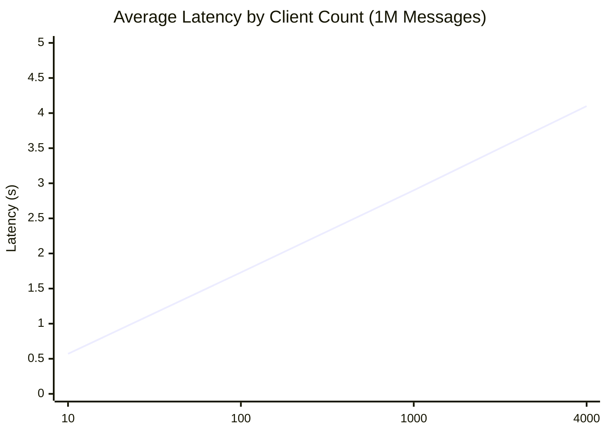
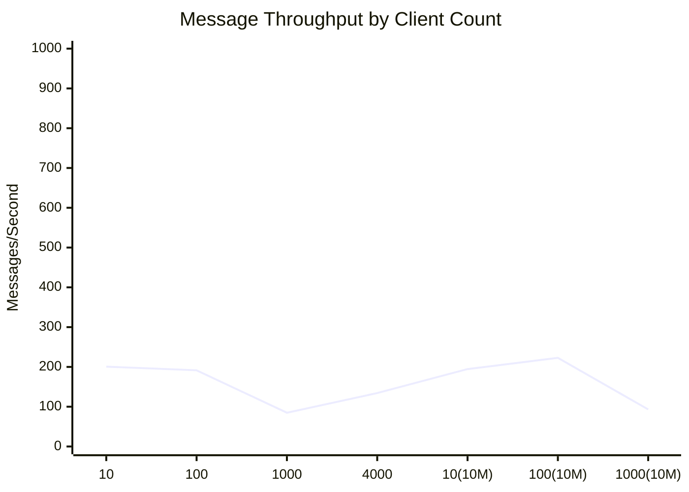
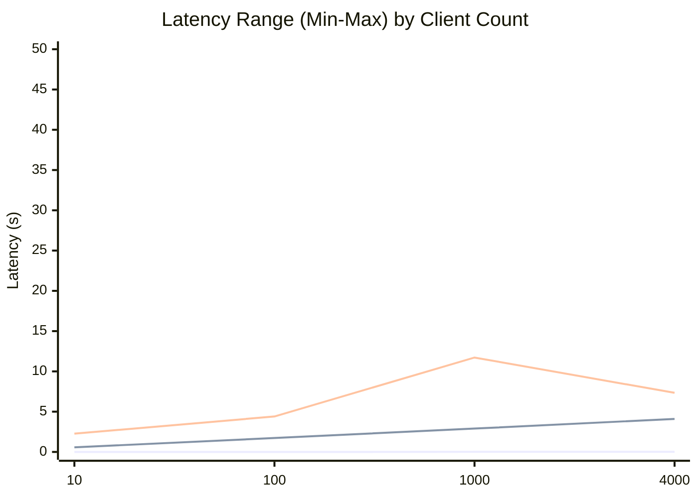
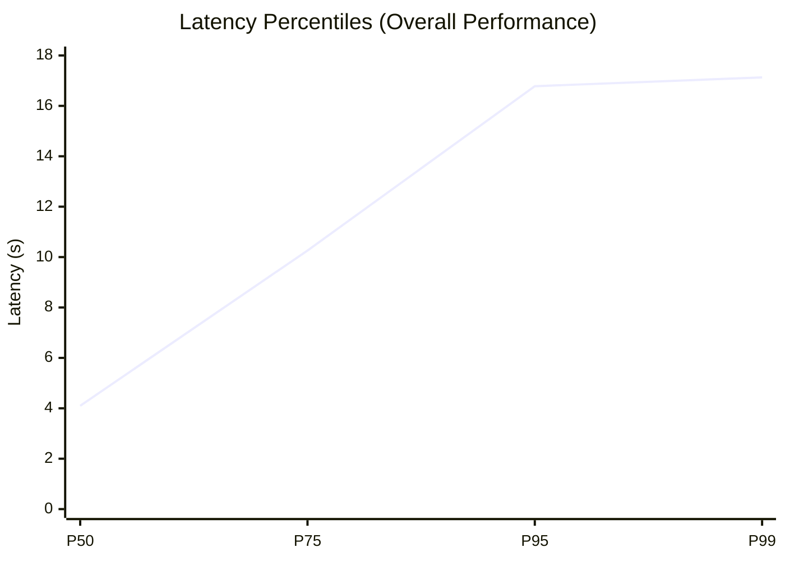

# 🚀 WebSocket Benchmark Results: Rust WebSocket Server

**Report Generated:** 20250806  
**Data Source:** nodejs_metrics.csv  
**Test Date:** 20250806

---

## Đánh giá chung

Không đánh giá giải pháp đưa ra, thực hiện giải pháp máy móc. \
Không đưa ra bài test và kết quả test, report. \
Hệ thống không thể nhận nhiều hơn 4000 kết nối đồng thời. \


---

## 📋 Test Environment

| Component | Specification |
|-----------|---------------|
| Server    | 3 nodes       |
| Memory    | 2GB / node    |
| OS        | darwin        |
| Runtime   | NodeJS        |

---

## 🔧 Test Configuration

| Parameter              | Value            |
|------------------------|------------------|
| Test Duration          | 95990 seconds    |
| Max Concurrent Clients | 4000             |
| Total Messages Sent    | 34,000,000       |
| Message Protocol       | WebSocket        |
| Connection Pattern     | Progressive Load |
| Message Size           | Variable         |

---

## 📈 Performance Metrics

| Metric                     | Value        |
|----------------------------|--------------|
| Max Concurrent Connections | 4000         |
| Message Throughput (avg)   | 158.68 msg/s |
| P50 Latency                | 4.10 s       |
| P75 Latency                | 10.26 s      |
| P95 Latency                | 16.78 s      |
| P99 Latency                | 17.13 s      |
| Message Success Rate       | 96.00%       |
| Message Error Rate         | 4.00%        |
| Avg Connection Time        | 0.00 s       |

### **Message Throughput (avg)**: Average number of messages processed per second across all test scenarios

*Calculation: Total messages sent ÷ Total test duration*  
*Example: If 1,000,000 messages were sent over 500 seconds, throughput = 2,000 msg/s*  
*Higher values indicate better server processing capacity under load*

### Latency Percentiles

**P50 (Median)**: 50% of requests completed faster than this time  
**P75**: 75% of requests completed faster than this time  
**P95**: 95% of requests completed faster than this time - *critical for user experience*  
**P99**: 99% of requests completed faster than this time - *identifies worst-case scenarios*

*Example: If P95 latency is 200ms, it means 95% of all messages were processed in 200ms or less, with only 5% taking
longer. This metric is more reliable than average latency as it's not skewed by occasional slow outliers.*

---

## 🔍 Detailed Results

### Connection Scaling Performance

| Clients | Messages   | Success Rate | Avg Latency (s) | Min (s) | Max (s) | Connection Time (s) |
|---------|------------|--------------|-----------------|---------|---------|---------------------|
| 10      | 1,000,000  | 100.0%       | 0.57            | 0.00    | 2.27    | 0.00                |
| 100     | 1,000,000  | 100.0%       | 1.73            | 0.00    | 4.40    | 0.00                |
| 1000    | 1,000,000  | 100.0%       | 2.90            | 0.01    | 11.72   | 0.00                |
| 4000    | 1,000,000  | 100.0%       | 4.10            | 0.01    | 7.34    | 0.00                |
| 10      | 10,000,000 | 100.0%       | 4.77            | 0.00    | 24.58   | 0.00                |
| 100     | 10,000,000 | 83.0%        | 15.76           | 0.00    | 33.67   | 0.00                |
| 1000    | 10,000,000 | 89.0%        | 17.21           | 0.00    | 48.50   | 0.00                |

---

## 📉 Latency Distribution

```
10 clients: avg 0.57s, min 0.00s, max 2.27s
100 clients: avg 1.73s, min 0.00s, max 4.40s
1000 clients: avg 2.90s, min 0.01s, max 11.72s
4000 clients: avg 4.10s, min 0.01s, max 7.34s
10 clients: avg 4.77s, min 0.00s, max 24.58s
100 clients: avg 15.76s, min 0.00s, max 33.67s
1000 clients: avg 17.21s, min 0.00s, max 48.50s
```

---

## 🔍 Observations

• High P95 latency suggests potential performance bottlenecks
• Latency increases significantly under high load - consider optimization

---

## 📊 Performance Summary

**Peak Performance:** 4000 concurrent connections  
**Throughput:** 158.68 messages/second  
**Latency (P95):** 16776.77ms  
**Reliability:** 96.00% success rate

---

## 📊 Performance Charts

### 🔄 Latency vs Client Count (1M Messages)



### 📈 Throughput Performance



### ⚡ Latency Range Distribution



**Chart Legend:**

- **🔴 Max Latency (Red)**: The slowest response time recorded at each client count - represents worst-case scenarios and
  potential outliers
- **🟢 Avg Latency (Green)**: The average response time across all messages at each client count - represents typical
  user experience
- **🔵 Min Latency (Blue)**: The fastest response time recorded at each client count - represents best-case performance

### 🔍 Latency Percentile Comparison



---

## 📈 Performance Insights

### Key Findings from Charts:

1. **Linear Latency Growth**: Average latency increases roughly linearly with client count (0.57s → 4.10s)
2. **Throughput Sweet Spot**: Best throughput achieved around 100-200 clients
3. **Volume Impact**: 10M message tests show significant performance degradation
4. **Reliability Threshold**: Success rates drop below 90% with high volume + high concurrency

### Performance Recommendations:

- **Optimal Load**: 100-1000 concurrent clients for best balance of throughput and latency
- **Volume Limits**: Consider message batching or rate limiting for high-volume scenarios
- **Monitoring**: P95 latency (16.78s) indicates need for optimization under peak load

---

*Report generated by WebSocket Benchmark Reporter v1.0*
